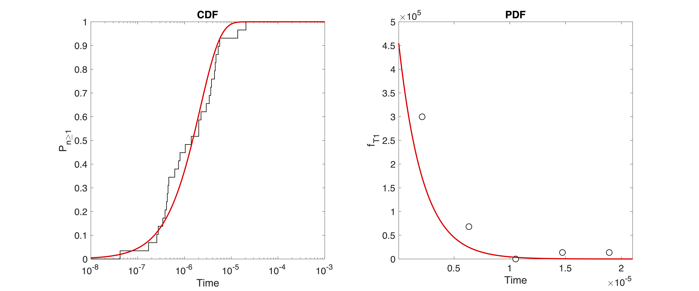

# Infrequent-metadynamics

**First step**:

Run infrequent metadynamics using the `plumed.dat` file. The basic idea of infrequent metadynamics is that the transition state along CV should be bias free. Please see https://pubs.acs.org/doi/10.1021/ct500040r for theoretical description of the method.

In our case we will use `\chi_1` and `\chi_2` angle of Tyrosine as CV. Our aim is to calculate transition time associated with **normal** to **flip** transition as shown in the following picture.

The flipping is defined `-2.6 > \chi_1 > 2.6` which corresponds to the following code in the `plumed.dat`   

```
COMMITTOR ...
  ARG=chi1_78
  STRIDE=100
  # Flipped Basin 1
  BASIN_LL1=-3.14
  BASIN_UL1=-2.6
  # Flipped basin 2
  BASIN_LL2=2.6
  BASIN_UL2=3.14
  FILE=commit.log FMT=%8.4f
... COMMITTOR
```
The simulation will stop once you reach the desired basin. See the COMMITTOR syntax here: https://www.plumed.org/doc-v2.6/user-doc/html/_c_o_m_m_i_t_t_o_r.html
see the metadynamics syntax here:https://www.plumed.org/doc-v2.6/user-doc/html/_m_e_t_a_d.html

The idea is to launch multiple infrequent metadynamics simulations to ggather statistics. The simulation will produce a file called `COLVAR-tyr` whose header will look like the following

```
#! FIELDS time chi1_78 chi2_78 metad.bias metad.rbias metad.rct metad.work metad.acc
#! SET min_chi1_78 -pi
#! SET max_chi1_78 pi
#! SET min_chi2_78 -pi
#! SET max_chi2_78 pi
 0.000000 -1.130508 -1.245711 0.000000 -0.000000 0.000000 0.000000 1.000000
```
the tail will look like following

```
 16100.000000 -2.334819 1.604114 0.000000 -0.723659 0.723776 881.955366 2.927465
 16101.000000 -2.652049 1.922205 0.000000 -0.723776 0.723776 882.554972 2.927346
```

You can see when it switch to **flip** basin the value of `metad.bias` is `zero`

One the simulations are finished you exceute `analysis.sh` script which uses `ts_detect.py` and it prints the value of transition time in each simulation in `sec`

**Analysis**

I have gathered all the values from my simulation as `transition-time.xvg` and `times.txt` inside the `ks_test` and `error-analysis` folder.

Install Matlab. Go to `ks_test` folder and execute the `fileread.m` file and you will gnerate a CDF plot and other statistics as described here: https://pubs.acs.org/doi/10.1021/ct500040r



Next we will plot the estimated `p-value` and `transition times` with error bars. Go to `error-analysis` folder and run `error_Nsim.m`. This will generate a file `SD_Nsim.txt`. Use `error-plt.plt` to plot the results


Cite the following:

1. Assessing the Reliability of the Dynamics Reconstructed from Metadynamics, Matteo Salvalaglio, Pratyush Tiwary, and Michele Parrinello, Journal of Chemical Theory and Computation 2014 10 (4), 1420-1425, DOI: 10.1021/ct500040r
2. P. Tiwary and M. Parrinello, From Metadynamics to Dynamics, Phys. Rev. Lett. 111 (230602) 2013.Link: https://journals.aps.org/prl/abstract/10.1103/PhysRevLett.111.230602 


